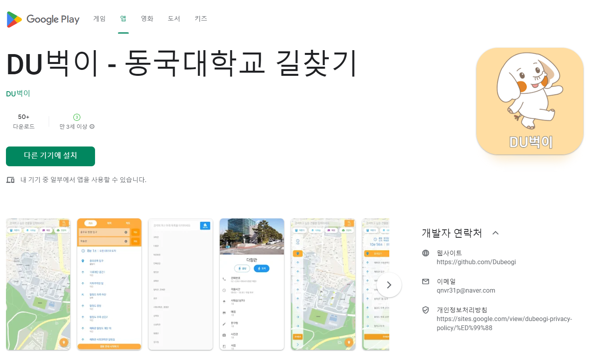

# DU벅이 - 동국대학교 길찾기 어플리케이션
수직 이동 및 실내 경로를 포함한 동국대학교 전용 경로 안내 어플리케이션
[[Google Play 스토어 링크]](https://play.google.com/store/apps/details?id=com.flutter.dubeogi)

## 📋 프로젝트 소개
- 2023년 1학기 정보통신공학과 전공 캡스톤디자인1 'DU벅이'조 결과물 
- 서버와 API를 사용하지 않고 구현한 이미지 기반 길찾기 어플리케이션

## ⌛ 개발 기간
- 23.03.02 ~ 23. 06.15

### 🧑‍🤝‍🧑 멤버구성
- 팀장: 강성민
- 팀원1: 이헌원
- 팀원2: 강상훈
- 팀원3: 서호준

### 🔧 개발 환경
- **IDE**: 
- **Framework**: 
- **Language**: 

### ⏰ 개발 타임라인
- 타임라인 [[Link]](https://github.com/ReturnRudi/Dubeogi/blob/master/timeline.md)

### 📃 최종 보고서
- 최종보고서 [[Link]](https://github.com/ReturnRudi/Dubeogi/blob/master/report.md)

### 🎞 발표자료
- 발표자료 [[Link]](https://github.com/ReturnRudi/Dubeogi/blob/master/ppt.md)

### 🚨 에러수집
- 구글폼 [[Link]](https://forms.gle/QyyDc98YARxDLh9L7)
